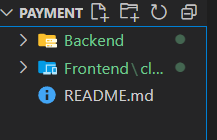
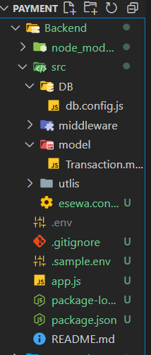
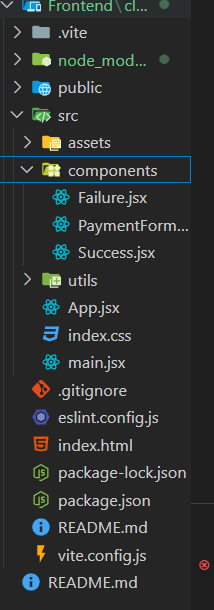

# Esewa-NPM

*i know payment integration seem very hard as when i try to integrate it i felt very overwhelmed and reading those whole docs seem very time consuming so i just made a NPM package to simplify this*
### just read 10-12 line only u will know how to integreate or watch the youtube turtorial for this
[youtube/animezoneamv](https://youtu.be/im10rG7Uvis)


------------------------
#### how our NPM package work

## install in terminal
 ```
 npm i esewajs
 ```

------------------------------------------------
## initialize Integration
```
import { EsewaPaymentGateway } from "esewajs";


await   EsewaPaymentGateway(amount,productDeliveryCharge,productServiceCharge,taxAmount,transaction_uuid,
  product_code,SECRET,success_url,failure_url,ESEWAPAYMENT_URL,undefined,undefined)
```

**there is 2 undefined first one is for algorithm which is set to sha256 by default as esewa use it and another is encoding which is set to base64 by default || as u can write it explictly too**

### the EsewaCheckStatus is used to check if payment is successfull or unsuccessful
```
import { EsewaCheckStatus } from "esewajs";

await  EsewaCheckStatus(total_amount,transaction_uuid,product_code,ESEWAPAYMENT_STATUS_CHECK_URL)

```

--------------
# step by step on how to use the package
---------
###  import these on your terminal 

```
1. npm install axios
2. npm i body-parser
3. npm i dotenv
4. npm i express
5. npm i mongoose
6. npm i esewajs
```


---------------------
## importing the package for Backend Folder ###
**module.js**
```
import { EsewaPaymentGateway,EsewaCheckStatus } from "esewajs";
```

**common.js**
```
const { EsewaPaymentGateway, EsewaCheckStatus } = require('esewajs');
```

------------------------
## importing the package for Frontend Folder ###
**module.js**

```
import { generateUniqueId,base64Decode } from "esewajs";
```

**common.js**
```
const { generateUniqueId,base64Decode } = require('esewajs');
```

 #### lets integrete (You can start from here without reading Detail docs tooo 😊😊😊)
  0. step :0 folder setup
  **project- ROOT DIRECTORY**


  project -Backend folder

  


 1. step 1:setting the backend
        *app.js*

```
import dotenv from "dotenv";
import express from "express";
import bodyParser from "body-parser";
import cors from "cors";
import { EsewaInitiatePayment, paymentStatus } from "./src/esewa.controller.js";
import connectDB from "./src/DB/db.config.js"


// Load environment variables from .env file
dotenv.config();
const app = express();
const PORT = process.env.PORT || 3000;
connectDB();

app.use(cors('http://localhost:5173',credential:true));//replace with your local host


//middle ware
app.use(bodyParser.json());
app.use(bodyParser.urlencoded({ extended: true }));

//routes
app.post("/initiate-payment", EsewaInitiatePayment);
app.post("/payment-status", paymentStatus);


//start server
app.listen(PORT, () => {
  console.log(`Server is running on http://localhost:${PORT}`);
});
```


---------

 *DB /  db.config.js*

  ```
  import mongoose from "mongoose";
const connectDB = async() => {
  try {
   await mongoose.connect('mongodb://127.0.0.1:27017/mydatabase').then((res) => {
      console.log("MongoDB connected successfully");
    });
  } catch (error) {
    console.error("MongoDB connection error:", error);
  }
};
export default connectDB;
```
------------------
*model / Transaction.model.js*
```
import mongoose from "mongoose";// Define the Transaction schema
const transactionSchema = new mongoose.Schema(
  {product_id: {
      type: String, 
      required: true,
    },
    amount: {
      type: Number,
      required: true,
      min: 0, // Amount should not be negative
    },
    status: {
      type: String,
      required: true,
      enum: ["PENDING", "COMPLETE", "FAILED", "REFUNDED"], // Example statuses
      default: "PENDING",
    },
  },
  {
    timestamps: true, // Adds createdAt and updatedAt fields automatically
  }
);
// Create the Transaction model from the schema
export const Transaction = mongoose.model("Transaction", transactionSchema);
```
------------------------
*esewa.controller.js*
```
import { Transaction } from "./model/Transaction.model.js"; //for saving the ordered data in database

import { EsewaPaymentGateway,EsewaCheckStatus } from "esewajs"; //we install our package hehe


const EsewaInitiatePayment=async(req,res)=>{
      const { amount, productId } = req.body;  //data coming from frontend
try {
      const  reqPayment=await EsewaPaymentGateway(
        amount,0,0,0,productId,process.env.MERCHANT_ID,process.env.SECRET,process.env.SUCCESS_URL,process.env.FAILURE_URL,process.env.ESEWAPAYMENT_URL,undefined,undefined)
  if(!reqPayment){
    return res.status(400).json("error sending data")

  }
        if (reqPayment.status === 200) {
                  const transaction = new Transaction({
                    product_id: productId,
                    amount: amount,
                  });
                  await transaction.save();
                  console.log("transaction passed   ")
                  return res.send({
                    url: reqPayment.request.res.responseUrl,
                  });
                }
   }
  catch (error) {
  return res.status(400).json("error sending data")

   }}


const paymentStatus=async (req, res) => {
              const { product_id } = req.body; // Extract data from request body
              try {
                // Find the transaction by its signature
                const transaction = await Transaction.findOne({ product_id });
                if (!transaction) {
                  return res.status(400).json({ message: "Transaction not found" });
                }
            
           const paymentStatusCheck=await   EsewaCheckStatus(transaction.amount,transaction.product_id,process.env.MERCHANT_ID,process.env.ESEWAPAYMENT_STATUS_CHECK_URL)
        
            
            
                if (paymentStatusCheck.status === 200) {
                  // Update the transaction status
                  transaction.status = paymentStatusCheck.data.status;
                  await transaction.save();
                  res
                    .status(200)
                    .json({ message: "Transaction status updated successfully" });
                }
              } catch (error) {
                console.error("Error updating transaction status:", error);
                res.status(500).json({ message: "Server error", error: error.message });
              }
            };

  export {EsewaInitiatePayment,paymentStatus}

```
-----

*.env*
```
PORT=3000
MONGO_URI=mongodb://127.0.0.1:27017/mydatabase
MERCHANT_ID=EPAYTEST
SUCCESS_URL=http://localhost:5173/payment-success 
FAILURE_URL=http://localhost:5173/payment-failure
ESEWAPAYMENT_URL=https://rc-epay.esewa.com.np/api/epay/main/v2/form
SECRET=8gBm/:&EnhH.1/q
ESEWAPAYMENT_STATUS_CHECK_URL=https://uat.esewa.com.np/api/epay/transaction/status/
```
### important Note for  ESEWA of .env 
1. Testing: https://rc-epay.esewa.com.np/api/epay/main/v2/form
2. Production: https://epay.esewa.com.np/api/epay/main/v2/form
3. *for testing locally use  ESEWAPAYMENT_URL= https://rc-epay.esewa.com.np/api/epay/main/v2/form in .env file  *
4. for production use  ESEWAPAYMENT_URL= https://epay.esewa.com.np/api/epay/main/v2/form    in .env file  *

3. MERCHANT_ID will be provided by esewa ,you should reach out to them
*Success_URL is for esewa redirect your browser to your custommade sucesspage and if it fail it will redirect to your failure page*

**Backend setup complete**


## frontend setup



**install this in your frontend folder terminal**
1. npm i axios
2. npm i react
3. npm i react-dom
4. npm i reacr-router-dom

**create 3 file**
1. PaymentForm.jsx //this is for calling the esewa form by clicking
2. Success.jsx  //this will be redirect by esewa if payment is successful 
3. Failure.jsx  //this will be redirect by esewa if payment fail

**remember we gave sucess URL in the .env and were passing in the esewajs package ,yes so that esewa will redirect us to the url which is either success or failure payment page

**Payment.jsx**

```
import React, { useState } from "react";
import axios from "axios";
import { generateUniqueId } from "esewajs";

const PaymentComponent = () => {
  const [amount, setAmount] = useState("");

  const handlePayment = async (e) => {
    e.preventDefault();
    try {
      const response = await axios.post(
        "http://localhost:3000/initiate-payment", //server payment route
        {
          amount,
          productId: generateUniqueId(),
        }
      );

      window.location.href = response.data.url;
    } catch (error) {
      console.error("Error initiating payment:", error);
    }
  };

  return (
    <div>
      <h1>eSewa Payment Integration</h1>

      <div className="form-container" onSubmit={handlePayment}>
        <form className="styled-form">
          <div className="form-group">
            <label htmlFor="Amount">Amount:</label>
            <input
              type="number"
              value={amount}
              onChange={(e) => setAmount(e.target.value)}
              required
              placeholder="Enter amount"
            />
          </div>

          <button type="submit" className="submit-button">
            Pay with eSewa
          </button>
        </form>
      </div>
    </div>
  );
};

export default PaymentComponent;
```


**failure.jsx**
```
import React from "react";
import { useNavigate } from "react-router-dom";

const Failure = () => {
  const navigate = useNavigate();
  return (
    <div>
      <h1>Payment Failed!</h1>
      <p>There was an issue with your payment. Please try again.</p>
      <button onClick={() => navigate("/")} className="go-home-button">
        Go to Homepage
      </button>
    </div>
  )
};

export default Failure;
```

**Success.jsx**
```
import React, { useEffect, useState } from "react";
import { useLocation, useNavigate } from "react-router-dom";
import {base64Decode} from "esewajs"
import axios from "axios";
const Success = () => {
  const [isSuccess, setIsSuccess] = useState(false);
  const [isLoading, setIsLoading] = useState(true);
  const navigate = useNavigate();
  const location = useLocation();
  // Create a new URLSearchParams object using the search string from location
  const queryParams = new URLSearchParams(location.search);
  const token = queryParams.get("data");
  // Decode the JWT without verifying the signature
  const decoded = base64Decode(token);
  const verifyPaymentAndUpdateStatus = async () => {
    try {
      const response = await axios.post(
        "http://localhost:3000/payment-status",
        {
          product_id: decoded.transaction_uuid,
        }
      );
      if (response.status === 200) {
        setIsLoading(false);
        setIsSuccess(true);
      }
    } catch (error) {
      setIsLoading(false);
      console.error("Error initiating payment:", error);
    }
  };
  useEffect(() => {
    verifyPaymentAndUpdateStatus();
  }, []);
  if (isLoading && !isSuccess) return <>Loading...</>;
  if (!isLoading && !isSuccess)
    return (
      <>
        <h1>Oops!..Error occurred on confirming payment</h1>
        <h2>We will resolve it soon.</h2>
        <button onClick={() => navigate("/")} className="go-home-button">
          Go to Homepage
        </button>
      </>
    );
  return (
    <div>
      <h1>Payment Successful!</h1>
      <p>Thank you for your payment. Your transaction was successful.</p>
      <button onClick={() => navigate("/")} className="go-home-button">
        Go to Homepage
      </button>
    </div>
  );
};
export default Success;
 
```

*the esewa provide addition data to the success URL so we have to decode it will base64 decode fucntion*

### donot forget to route the component

**in the app.jsx**
```
import { BrowserRouter as Router, Route, Routes } from "react-router-dom";
import Failure from "./components/Failure";
import PaymentComponent from "./components/PaymentForm";
import Success from "./components/Success";
 
function App() {
  return (
    <Router>
        <div className="App">
          <Routes>
            <Route path="/" element={<PaymentComponent />} />
            <Route path="/payment-success" element={<Success />} />
            <Route path="/payment-failure" element={<Failure />} />
          </Routes>
        </div>
      </Router>
    );
}

export default App;
```
**congrats u made a Esewa payment integration**
**You can read More detail docs if u want**
**Transaction Flow**
1. When user choses eSewa as on-line payment option from partner merchant application, then user is temporarily redirected to eSewa ePay login page.

2. User will provide valid credentials on login page.

3. By confirming the transaction, user is accepting the transaction details sent by partner merchants.

4. After each successful transaction, the user is redirected back to partner merchant's success page. If transaction fails due to any reason (which includes user canceling transaction), the user is informed by appropriate failure message and redirected back to partner merchant's failure page.

5. For every successful transaction, the merchant account is credited accordingly and notified via email/SMS regarding transaction.

6. If a response is not received within five minutes, the status check API can be used to confirm the payment.

7. After receiving a response from the status check API, update the payment status accordingly.

**this is from ESEWA**
----------------------------------------------------------
## i will explain to u in short term ##
1. the Esewa api give LogIn page to us we login/signup to the esewa api and also in esewa Form .give money and OTP and esewa will send reponse
2. esewa will take amount ,and product ID and give response 
3.  as always after every transaction user/merchant(owner) will be notified that money is sent/received.

-----------------------------------------------------
### how it work


```
const reqPayment=await EsewaPaymentGateway(amount,productDeliveryCharge,productServiceCharge,taxAmount,productId,process.env.MERCHANT_ID,process.env.SECRET,process.env.SUCCESS_URL,process.env.FAILURE_URL,process.env.ESEWAPAYMENT_URL,algorithm,encoding)
```

**for developement phase  use productDeliveryCharge=0,
       productServiceCharge=0,
       taxAmount=0**

       
### Note
1. EsewaPaymentGateway return the response  which is from the Esewa
2. algorthm is already set to SHA256 u can left it undefined,it will work well
3. encoding is already set to base64 u can left it undefined it will work well 
  
*also work without explictly defining it*

```
const  reqPayment=await EsewaPaymentGateway(amount,productDeliveryCharge,productServiceCharge,taxAmount,productId,process.env.MERCHANT_ID,process.env.SECRET,process.env.SUCCESS_URL,process.env.FAILURE_URL,process.env.ESEWAPAYMENT_URL,undefined,undefined)
```

*if u want to use it explictly u can use it like this *
```
const  reqPayment=await EsewaPaymentGateway(amount,productDeliveryCharge,productServiceCharge,taxAmount,productId,process.env.MERCHANT_ID,process.env.SECRET,process.env.SUCCESS_URL,process.env.FAILURE_URL,process.env.ESEWAPAYMENT_URL,"sha256","base64")
```
        * as esewa use sha256 algorithm  and base64 for encoding*


## You might wonder why there is 2 function in the Backend as the payment integration should have 1 functio 
*the EsewaPaymentGateway function  helps the browser to redirect to the esewa payment gateway and then help in transaction flow*
*the  EsewaCheckStatus function is used to check if the payment is done or not by providing the product code to the esewa server  *


## You might also wonder why there is 2 function in the Frontend too
*the generateUniqueId function helps to generate a unique id for the product so that esewa will accept it as product id and amount is send directly*
*the base64Decode function is use to decode the informatin as if the payment is successful esewa redirect us to the success_url as we have in .env file as we proviude in function too *
await   EsewaPaymentGateway(amount,productDeliveryCharge,productServiceCharge,taxAmount,transaction_uuid,
  product_code,SECRET,success_url,failure_url,ESEWAPAYMENT_URL,algorithm,encoding)

## info about the algorithm and encoding  
*we use algorithm and encoding as undefined in the doc  because when u left it undefined by default it will take algorithm and encoding of Esewa i.e. hsa256 and base64*
